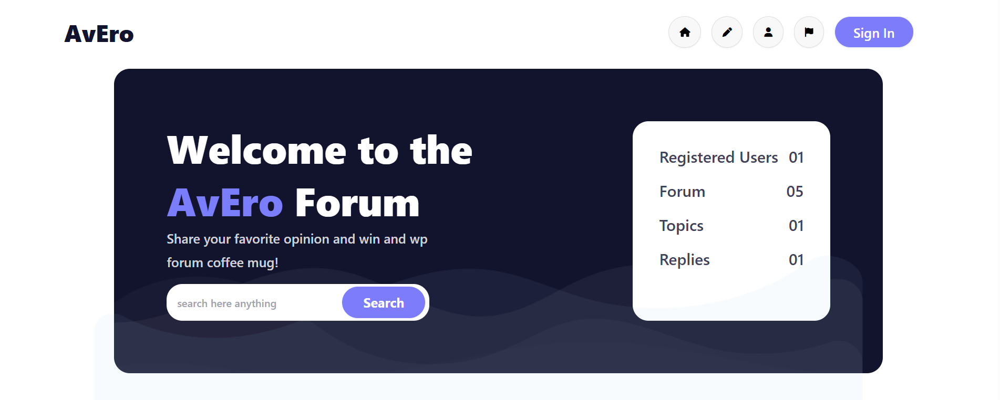
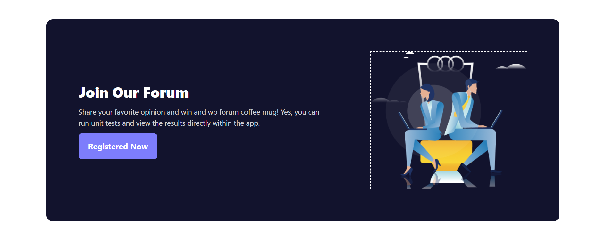
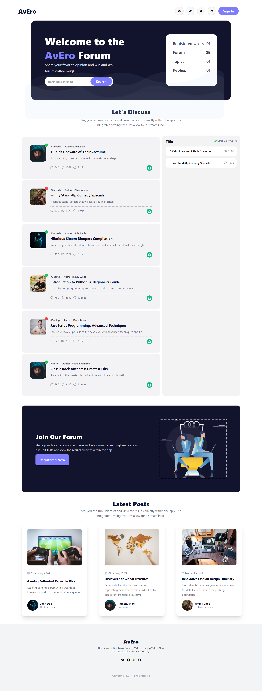

# Avero | Article Reader Web Page

**Avero** is a responsive article reader web application where users can:

- Browse and read articles
- Search for specific articles
- Mark articles as "Read" to keep track of what they've viewed

Built using **HTML**, **Tailwind CSS**, **DaisyUI**, and **JavaScript (DOM Manipulation)**.

[🔗 Live Demo](https://avijitbwas.github.io/avero)

---

## 🛠️ Tech Stack

- **HTML5**
- **Tailwind CSS**
- **DaisyUI**
- **JavaScript (Vanilla)**
- **RESTful API** (for data)
---

## 🌟 Features

- 🔎 Search articles by keyword
- ✅ Mark articles as "Read"
- 📚 Browse multiple content cards
- 🧠 DOM manipulation for dynamic interactions
- 📱 Fully responsive across devices

---

---

## 📁 Folder Structure

```
avero/
├── assets/
│   ├── background/         # Background files
│   ├── logo/               # Logo files
│   ├── images/             # images files
├── preview/                # Screenshots for README
├── script/                 # JavaScript for area calculations
├── index.html              # Main landing page
└── README.md               # Project documentation
└── tailwind.config.js      # Tailwind config
```

---

## 🖼️ Screenshots

### 👣 Hero



### 👣 Full page preview



### 👣 Full page preview



---

## 📲 How to Use Locally

1. **Clone the repo**
   ```bash
   git clone https://github.com/avijitbwas/avero.git
   cd avero
   ```

# 👤 Author

# Avijit Biswas

## :mailbox: Reach me out

<p align="left">
<a href="avijit0ae@gmail.com" target="_blank">
  
</a>
<a href="https://www.linkedin.com/in/avijitbwasb" target="_blank">
  
</a>
<a href="https://discord.com/users/avijitbwas" target="_blank">
  
</a>
<a href="https://x.com/avijitbwas" target="_blank">
  
</a>
<a href="https://www.instagram.com/avijitbwas" target="_blank">
  
</a>
<a href="https://www.facebook.com/avijitbwas" target="_blank">
  
</a>
</p>
